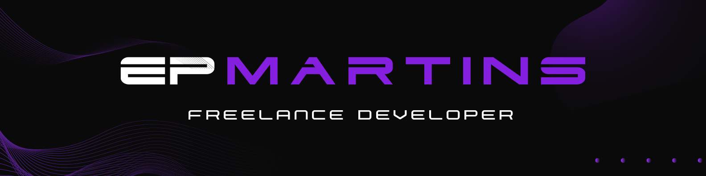

<p align="center">
  
</p>

<h1 align="center">Olá, eu sou o Eduardo 👋</h1>

<p align="center">
  Desenvolvedor com experiência em <strong>backend, APIs, integrações e produtos digitais</strong>,
  unindo visão técnica e entendimento de negócio para construir soluções úteis, escaláveis e bem pensadas.
</p>

<p align="center">
  <a href="https://www.epmartins.com.br">Portfólio</a>
  ·
  <a href="https://www.linkedin.com/in/eduardo-pires-martins/">LinkedIn</a>
  ·
  <a href="mailto:contato@epmartins.com.br">Contato</a>
</p>

---

## Sobre mim

Sou um profissional de tecnologia com vivência em desenvolvimento de software, APIs, produtos digitais e ambientes corporativos do setor financeiro. Tenho interesse especial por soluções que conectam tecnologia, experiência do usuário e impacto real no negócio.

Hoje venho fortalecendo uma atuação híbrida entre **Engenharia de Software, Produto e Tecnologia**, com foco em construir aplicações bem estruturadas, documentadas e orientadas a valor.

- Backend e APIs com **.NET, C#, Node.js e TypeScript**
- Frontend com **React, Tailwind e interfaces responsivas**
- Experiência com integrações, autenticação, cloud e produtos digitais
- Interesse em **Product Ownership, discovery, priorização e entrega de valor**
- Criador de projetos como **Collabore**, **ParoquialApp** e **epmartins.com**

---

## Tecnologias e ferramentas

<p align="left">
  
</p>

---

## Projetos em destaque

### epmartins.com
Portfólio profissional criado para apresentar serviços, cases e posicionamento como desenvolvedor.  
**Stack:** React, TypeScript, Tailwind, Web Design, UI/UX.

### jwt-validator-api
API para validação e estudo de autenticação com JWT.  
**Stack:** Backend, autenticação, segurança e APIs REST.

### Collabore
Plataforma de impacto social para conectar ONGs, voluntários e empresas.  
**Stack:** React, TypeScript, .NET, APIs, mobile/PWA e produto digital.

### ParoquialApp
SaaS para paróquias com foco em gestão de dizimistas e contribuição online.  
**Stack:** Produto SaaS, dashboard, pagamentos, gestão e experiência do usuário.

---

## O que me diferencia

```txt
Tecnologia com visão de produto.
Código com clareza.
Soluções com propósito.
```

Acredito que bons sistemas não nascem apenas de código funcionando, mas de entendimento do problema, clareza de prioridade e cuidado com a experiência de quem usa.

---

## GitHub em números

<p align="center">
  
  
</p>

<table align="center">
  <tr>
    <td align="center" width="280">
      <a href="https://github.com/users/eduardopiresmartins/achievements/yolo">
        
      </a>
      <br />
      <strong>YOLO</strong>
      <br />
      100% unlocked
    </td>
    <td align="center" width="280">
      <a href="https://github.com/users/eduardopiresmartins/achievements/pull-shark">
        
      </a>
      <br />
      <strong>Pull Shark</strong>
      <br />
      x2
    </td>
  </tr>
</table>

### Achievements

- **YOLO**: desbloqueado em 100% em 13 de março, com merge sem review no PR [Collabore/collabore-app#15](https://github.com/Collabore/collabore-app/pull/15).
- **Pull Shark x2**: conquistado com PRs merged, incluindo [Collabore/collabore-api#3](https://github.com/Collabore/collabore-api/pull/3) e [Collabore/collabore-app#6](https://github.com/Collabore/collabore-app/pull/6).
- Perfil de conquistas: [GitHub Achievements](https://github.com/users/eduardopiresmartins/achievements/pull-shark)

---

## Vamos conversar?

Estou aberto a oportunidades em **Desenvolvimento de Software, Backend, Produto e Tecnologia**, especialmente em contextos onde seja possível unir construção técnica, visão de negócio e impacto para usuários.

<p align="center">
  <a href="https://www.epmartins.com.br"></a>
  <a href="https://www.linkedin.com/in/eduardo-pires-martins/"></a>
  <a href="mailto:contato@epmartins.com.br"></a>
</p>
